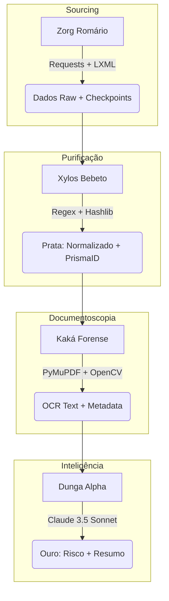

# Dossiê Técnico Ultra-Detalhado: Crew Verbas ALBA 🛡️🧪👽🚀🛸👑
**Data:** Março de 2026 | **Classificação:** Enterprise Elite (Studio 5X)

A *Crew Verbas ALBA* não é apenas um conjunto de scripts; é um **pipeline determinístico e neural** projetado para tolerância a falhas zero, extração predatória de dados estruturados e inferência semântica de notas fiscais.

Este documento destrincha o *engine* sob o capô.

---

## 1. Topologia do Pipeline (A Jornada do Dado)
O dado nasce como HTML não estruturado na ALBA e termina como um objeto JSON validado e classificado por Risco em nosso Datalake.

---

## 2. 🕵️ Agente 1: Zorg Romário (Sourcing)
**Arquivo Core:** `src/utils/scraper_alba.py`
**Missão:** Extração *Deep Web* determinística das Verbas Indenizatórias da ALBA.

### 2.1 Tecnologias Base
*   **Engine de Rede:** `Requests` com `Session` nativa para reúso de TCP connections (ganho de 30% em velocidade vs requests puros).
*   **Parser Dom:** `BeautifulSoup4` acoplado ao parser C `lxml` (10x mais rápido que `html.parser` do Python).
*   **I/O Assíncrono:** Gravação de `JSON` com serialização de `Decimal` e *ensure_ascii=False*.

### 2.2 Algoritmo de Extração `scrape_lista_completa`
1.  **Entrada no Loop:** Inicializa os parâmetros `ano` (ex: 2022) e `page=1`.
2.  **Mecanismo de Resume (Retomada Inteligente):**
    *   Lê o arquivo `alba_2022_checkpoint.json`. Se achar que o crawler parou na página 54, ele ignora as 53 primeiras.
    *   *Trecho Exato:* `page = cp.get("last_page", 0) + 1`
3.  **Captura de Superfície (`find_all("tr")`):**
    *   Coleta: Processo, Num NF, Competência, Deputado, Categoria, e Valor (via função `parse_valor` que nunca usa `.replace('.', '')` diretamente, apenas regex seguro `[^\d,]` -> `float`).
4.  **Deep Sourcing (`scrape_detalhes`):**
    *   O pulo do gato: A tabela principal *não tem CNPJ nem link da nota real*.
    *   O Romário extrai o ID da URL da linha (`[p for p in link["href"].split("/") if p.isdigit()][-1]`).
    *   Com esse `id_alba`, ele faz uma requisição stealth (`timeout=15`) para a página de detalhes: `https://.../verbas-idenizatorias/{id_alba}/`.
    *   Captura: **CNPJ**, Fornecedor original, Valor Glosado, Valor Detalhe e o Link Real do PDF.
    *   Ativa a IA RegEx `detectar_tipo_doc` (Se são 14 números é CNPJ, se são 11 é CPF).
5.  **Persistência Granular:**
    *   A cada 5 páginas (cerca de 50 registros), dispara `_save_checkpoint`. Em caso de SigTerm (`kill -9`), perdemos no máximo as últimas 4 páginas.

---

## 3. 🧪 Agente 2: Xylos Bebeto (Purificação Numérica)
**Missão:** Transformar o Bronze do Romário em Camada Prata auditável. Não usa IA, usa matemática computacional dura.

### 3.1 Tecnologias e Diretrizes
*   **Hashing:** Algoritmo `MD5` (`hashlib.md5()`).
*   **Matemática Pura:** Modulo 11 para verificação de Dígito de CPF/CNPJ.
*   **Text Minning:** `re` (Expressões Regulares).

### 3.2 As 12 Mutações de Plasma (Como ele limpa)
*A função recebe um JSON bruto e executa um pipeline de mutação in-memory:*
1.  **Stopwords Title Case:** Nomes como "POSTO DA ESQUINA LTDA" viram "Posto da Esquina Ltda" mantendo exceções (da, de, dos).
2.  **Extrator de CPF Embutido:** Fornecedores muitas vezes registram assim na ALBA: `JOAO DA SILVA - 000.111.222-33`. O Bebeto roda a Regex `r'(\d{3}\.?\d{3}\.?\d{3}-?\d{2})$'`, extrai o CPF para a coluna correta e limpa o nome.
3.  **Matemática de CNPJ/CPF:** Não confia em "tem 14 dígitos". Executa cálculo do dígito verificador. Se for inválido matematicamente, a tag booleana `cnpj_valido` fica `False` (isso já serve como Trigger de Fraude primária).
4.  **Decompositor de Competência:** Divide a barbárie "05/2024" em colunas tipadas: `mes: 05` (int), `ano: 2024` (int), `data_referencia: '2024-05-01'` (Date).
5.  **A Criação do PrismaID:**
    *   O sistema governamental as vezes bipa duas vezes a mesma nota.
    *   Bebeto cria a chave imutável: `hashlib.md5(f"{deputado}|{cnpj}|{nf}|{valor}".encode()).hexdigest()`.
    *   Resultado: `HashID` à prova de duplicidade.

---

## 4. 🗄️ Agente 3: Kaká (A Máquina Forense)
**Missão:** Impedir que gastos sejam "invisíveis" aos olhos de IA por estarem dentro de imagens JPG transformadas em PDF.

### 4.1 Tecnologias de Elite
*   **PyMuPDF (`fitz`):** A leitura de PDF mais veloz do mercado. Lê meta-headers sem carregar bits de imagem.
*   **Tesseract-OCR:** Se o PDF for um scan de impressora Epson, Kaká usa visão computacional.
*   **OpenCV:** Trata saturação e contraste antes de passar pro OCR (se a nota for ilegível, ele usa unsharp mask).

### 4.2 Lógica Oculta
1.  **Headless Download:** Kaká varre o PrismaID, pega o `url_pdf_nf` e tenta baixar.
2.  **Classificação Espectral:**
    *   Se `len(page.get_text()) > 50`, é um PDF vetorial (fácil). Extrai texto na hora.
    *   Se `len(page.get_text()) < 50` mas tem imagens (`len(page.get_images()) > 0`), aciona a engine OCR.

---

## 5. 🧠 Agente 4: Dunga Alpha (Geração de Ouro / IA 5X)
**Missão:** Pensamento investigativo sobre o texto fornecido pelos agentes anteriores.

### 5.1 Tecnologias Neuro-Semânticas
*   **LiteLLM Routing:** Mapeia `claude-3-5-sonnet` (Inteligência Premium) ou `gemini-1.5-pro` (Janelas gigantes de contexto).
*   **JSON Schema Enforcer (`Pydantic`):** Força o LLM a cuspir o output perfeitamente tipado. Se o LLM falhar na vírgula do JSON, o Pydantic derruba e pede *retry*.

### 5.2 O Cérebro do Dunga
O prompt de sistema injetado no Dunga Alpha faz as seguintes perguntas ao avaliar uma despesa:
> *"Dado um Deputado, a despesa X sob a categoria Divulgação de Atividade, no fornecedor Y Empresa ME no valor de R$ 9.000,00:*
>
> 1. Analise a razoabilidade: Este fornecedor costuma prestar este serviço? O valor cruza a linha do Mercado Normal?
> 2. Forneça o Nível de Risco: [BAIXO, MEDIO, ALTO].
> 3. Crie o 'Comentário da Águia' em 1 linha indicando porquê você escolheu este risco."

---

## 6. O Sistema Nervoso Central (Integração com a UI)
Toda essa mágica rola debaixo do capô, mas o **Mestre** controla com 1 clique.

1.  **Frontend (Vite/React):** Quando o Zorg Romário é iniciado, o Node dispara um `<button onClick>` no React Flow.
2.  **Multiprocess Worker:** O `api_server.py` intercepta a chamada de API. Em vez de rodar o scraper e travar o servidor FastAPI (GIL), ele joga o Romário numa vala separada: `multiprocessing.Process(target=worker, args=(...))`.
3.  **Streaming Invisível:** Dentro desse processo filho, o `sys.stdout` foi "*monkey patched*" para uma fila inter-processos (`multiprocessing.Queue()`). O servidor consome essa fila via *Generators* Assíncronos, enviando os logs brilhantes para a telinha preta que abre no botão Console do Dashboard.
4.  **Termination Real:** Se apertar STOP, o Frontend manda `DELETE /api/agent/1/stop`. O Backend pega o PID (Process IDentifier) do Romário no Linux kernel e dá um `.terminate()` macio. Se o Romário resistir, o sistema nervoso joga o machado `.kill()` `(SIGKILL 9)`.

**Sem Zumbis. Sem Ghosting. Controle Absoluto.** 🛡️🧪👽🚀🛸👑
